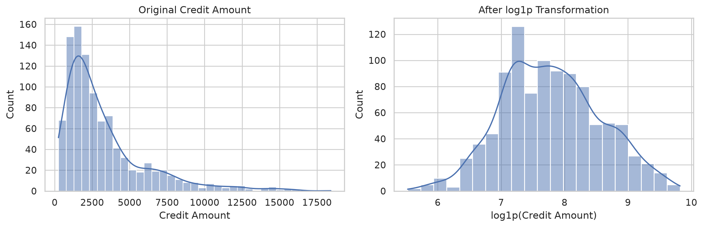
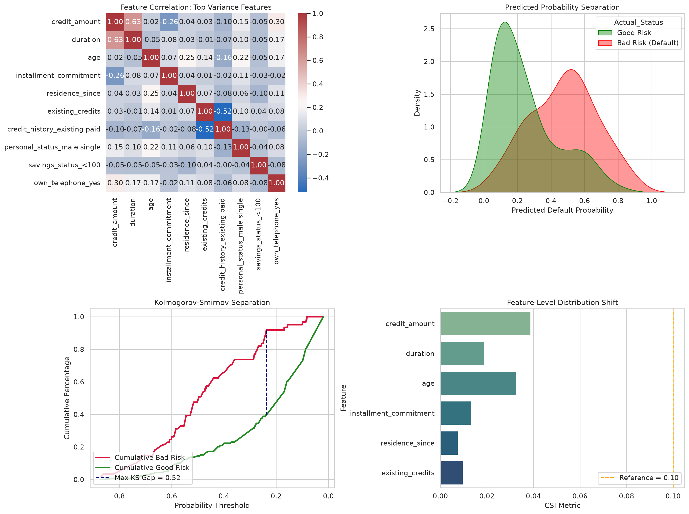

# Credit Risk Scorecard & Model Validation

Credit risk modeling project using Logistic Regression on the German Credit dataset from OpenML. The project covers EDA, preprocessing, model selection, discrimination metrics, and stability checks.

## Project Overview

The main goal is to build an interpretable model for separating higher-risk and lower-risk applicants.

The pipeline includes:

- Exploratory data analysis
- Distribution and skewness analysis
- Log transformation experiment
- Categorical encoding
- Median imputation
- Logistic Regression with L2 regularization
- Hyperparameter tuning with LogisticRegressionCV
- 5-fold cross-validation using ROC-AUC
- AUC, Gini and KS evaluation
- PSI and CSI stability checks
- Probability separation and correlation plots

The target is encoded as **bad = 1** and **good = 0**.

## Dataset

The project uses the OpenML **credit-g** German Credit dataset.

- 1,000 observations
- 20 original predictors
- Numerical and categorical variables
- Binary target: good / bad credit risk

The dataset is downloaded automatically when the script is run.

## Exploratory Data Analysis

EDA is done before modeling to understand the variables and their relationships.

Generated plots include:

- Class distribution
- Numerical feature distributions
- Numerical correlation heatmap
- Selected scatter plots
- Encoded feature correlation heatmap

The numerical distributions show that **credit_amount** is strongly right-skewed, while **age** is moderately right-skewed. **duration** is also non-symmetric and discrete.

**duration** and **credit_amount** have a moderate positive correlation. Both were kept because they represent different loan characteristics.

The scatter plots show considerable overlap between Good and Bad borrowers, so there is no simple single-feature rule separating the two classes.

## Skewness Handling

**credit_amount** was selected for a transformation experiment because of its right skew.

A **log1p(credit_amount)** version was created and compared with the original feature using the same train/holdout split and modeling approach.

The transformation was kept only if it improved holdout performance.

### Numerical Feature Distributions

### Credit Amount: Before vs After log1p

## Modeling

Categorical variables are one-hot encoded using `drop_first=True`.

Missing values are handled with median imputation. The imputer is fitted on the training data and then applied to the holdout data.

### Logistic Regression Hyperparameter Selection

`LogisticRegressionCV` is used to select the regularization parameter `C`.

The values tested are:

    C = [0.001, 0.01, 0.05, 0.1, 0.5, 1, 10]

The model uses:

- 5-fold cross-validation
- ROC-AUC for model selection
- L2 regularization
- `max_iter = 2000`
- `solver = liblinear`
- `random_state = 42`

The cross-validation is performed only on the training data. The holdout set is used after model selection for the final evaluation.

### Why C?

`C` is the inverse of regularization strength:

- Smaller `C` → stronger regularization
- Larger `C` → weaker regularization

There is no manually specified learning rate in this Logistic Regression model. The solver handles the optimization.

## Train / Holdout Design

The data is split into:

- 80% training data
- 20% holdout data

The original row order is preserved. The dataset does not contain real production timestamps, so this is an ordered holdout rather than a true Out-of-Time (OOT) validation.

Cross-validation is performed inside the training portion. The holdout data is not used for choosing `C`.

## Model Validation

The model is evaluated using both discrimination and stability measures.

### AUC

ROC-AUC measures how well the model ranks Bad borrowers above Good borrowers.

### Gini

Gini is calculated from AUC:

    Gini = 2 × AUC - 1

### KS Statistic

The Kolmogorov-Smirnov statistic measures the maximum separation between the score distributions of the two classes.

### PSI

Population Stability Index compares the predicted-probability distributions of the training and holdout samples.

PSI is a stability measure, not a model accuracy metric.

### CSI

Characteristic Stability Index is calculated for selected features to check for changes in their distributions between training and holdout data.

CSI is also a stability measure rather than a predictive-performance metric.

### Metrics

| Metric | Purpose |
|---|---|
| CV ROC-AUC | Select the regularization parameter |
| Holdout AUC | Measure discrimination on unseen data |
| Gini | Alternative form of AUC |
| KS | Measure class separation |
| PSI | Check score distribution stability |
| CSI | Check feature distribution stability |

The plots are used for visual inspection, while the metrics provide the numerical evaluation.

## Validation Dashboard

The dashboard contains:

1. Feature correlation
2. Predicted default-probability separation
3. KS separation
4. Feature-level CSI

## Transformation Experiment

`outputs/transformation_comparison.csv` contains the results for the original and `log1p(credit_amount)` versions.

It records:

- Selected `C`
- Cross-validation AUC
- Holdout AUC
- Gini
- KS

The version with better holdout performance is used as the final model.

## Outputs

    outputs/
    ├── class_distribution.png
    ├── numerical_distributions.png
    ├── credit_amount_transformation.png
    ├── transformation_comparison.csv
    ├── numerical_correlation.png
    ├── selected_relationships.png
    ├── full_feature_heatmap.png
    ├── validation_dashboard.png
    ├── model_metrics.csv
    └── csi_scores.csv

## Limitations

- Small public dataset
- No real production applicant timestamps
- Ordered holdout is not true production OOT validation
- PSI and CSI are sample-based diagnostics
- No production deployment or monitoring
- No regulatory compliance claim
- No adverse-action reason-code generation
- No calibration or business threshold analysis

## Project Structure

    credit-risk-scorecard/
    ├── README.md
    ├── scorecard_pipeline.py
    ├── requirements.txt
    ├── .gitignore
    ├── outputs/
    │   ├── class_distribution.png
    │   ├── numerical_distributions.png
    │   ├── credit_amount_transformation.png
    │   ├── numerical_correlation.png
    │   ├── selected_relationships.png
    │   ├── full_feature_heatmap.png
    │   ├── validation_dashboard.png
    │   ├── transformation_comparison.csv
    │   ├── model_metrics.csv
    │   └── csi_scores.csv
    └── .github/
        └── workflows/
            └── generate_outputs.yml

## How to Run

Install the dependencies:

    pip install -r requirements.txt

Run the pipeline:

    python scorecard_pipeline.py

The German Credit dataset is downloaded automatically and the generated files are saved under `outputs/`.

## Technologies

Python, Pandas, NumPy, Scikit-learn, Matplotlib and Seaborn.

## Author

Aanand Ajith  
B.Tech Mechanical Engineering, IIT Hyderabad
