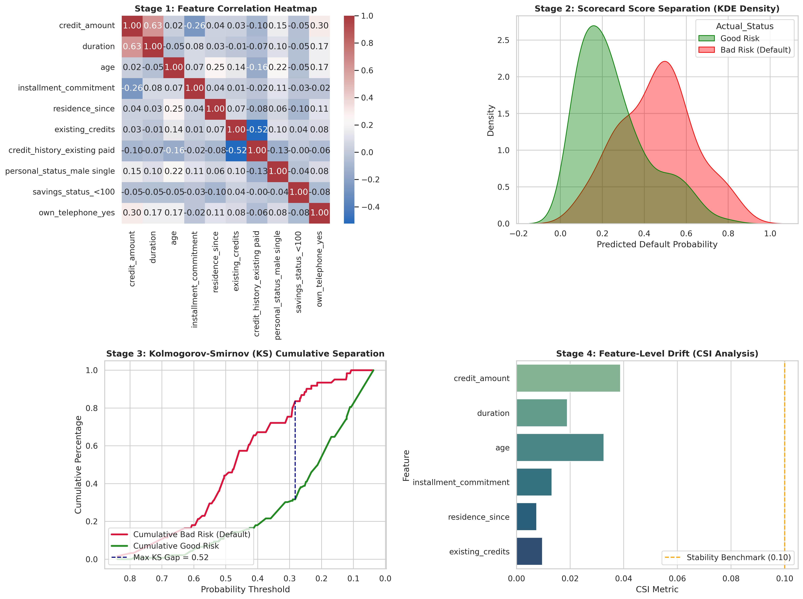

# Credit Risk Scorecard & Model Validation Pipeline

A production-ready credit scoring and model governance framework using the German Credit dataset (`credit-g`).

## Key Metrics & Governance Benchmarks

* **AUC & Gini:** Evaluates overall ranking performance between Good and Bad Risk.
* **KS Statistic:** Identifies maximum separation distance between cumulative bad and good risk distributions.
* **PSI & CSI:** Tracks score and feature distribution drift against stability thresholds.

---

## 📊 Visual Diagnostic Dashboard

<details>
<summary><b>▶ Click to Expand 4-Stage Diagnostic Charts</b></summary>

<br>



</details>

---

## 💻 Pipeline Implementation Code

<details>
<summary><b>▶ Click to View Python Source Code Snippet</b></summary>

```python
import numpy as np
import pandas as pd
from sklearn.linear_model import LogisticRegression
from sklearn.metrics import roc_auc_score, roc_curve

# Fit regularized scorecard baseline
model = LogisticRegression(C=0.05, max_iter=1000, random_state=42)
model.fit(X_train_clean, y_train)

# Model discrimination metrics
y_probs = model.predict_proba(X_test_clean)[:, 1]
auc = roc_auc_score(y_test, y_probs)
gini = 2 * auc - 1